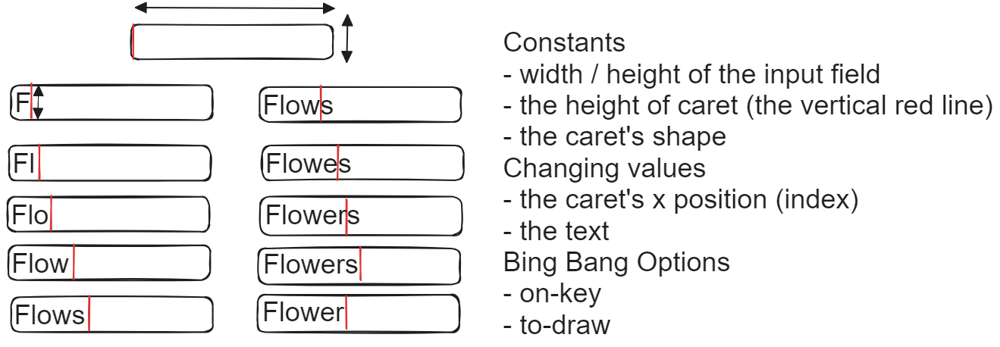

# A tiny editor
Built in BSL, a simple purely functional programming language.
This is a small homework project in SPD Course on EdX.

## Domain Analysis

https://github.com/elfaidi-ghassen/A-tiny-text-editor/assets/93406112/ff62c318-1627-48d1-8b37-becd5ef43fd4

